# CATEQUESIS ONLINE — Arquitectura del Sistema

> **Versión:** 1.0  
> **Estado:** Propuesta para aprobación  
> **Alcance:** Plataforma LMS institucional (single-tenant) para preparación sacramental  
> **Restricción:** Sin código de aplicación hasta aprobación de este documento

---

## Índice

1. [Visión y principios](#1-visión-y-principios)
2. [Arquitectura completa](#2-arquitectura-completa)
3. [Diagrama de base de datos](#3-diagrama-de-base-de-datos)
4. [Relaciones Firestore](#4-relaciones-firestore)
5. [Estructura de carpetas](#5-estructura-de-carpetas)
6. [Wireframes de dashboards](#6-wireframes-de-dashboards)
7. [Flujo de pagos (Wompi)](#7-flujo-de-pagos-wompi)
8. [Flujo de estudiantes](#8-flujo-de-estudiantes)
9. [Flujo de catequistas](#9-flujo-de-catequistas)
10. [Flujo de administradores](#10-flujo-de-administradores)
11. [Estrategia de despliegue](#11-estrategia-de-despliegue)
12. [Seguridad](#12-seguridad)
13. [Plan de implementación por fases](#13-plan-de-implementación-por-fases)

---

## 1. Visión y principios

### 1.1 Objetivo

Digitalizar el proceso de preparación sacramental (Bautismo, Primera Comunión, Confirmación) mediante una plataforma LMS moderna, accesible y administrable sin conocimientos técnicos.

### 1.2 Restricciones de diseño

| Restricción | Implicación arquitectónica |
|-------------|---------------------------|
| **No SaaS / No multi-tenant** | Una sola instancia, un solo `settings` global, sin `organizationId` en colecciones |
| **Sin datos falsos permanentes** | Seed scripts opcionales solo en entorno dev; producción inicia vacía |
| **Producción desde día 1** | Env vars, reglas Firestore, índices compuestos y Functions desplegados antes del go-live |
| **Firebase real** | Todas las operaciones CRUD contra Firestore/Auth/Storage reales |

### 1.3 Stack tecnológico

```
┌─────────────────────────────────────────────────────────────────┐
│                        CLIENTE (Browser)                        │
│  Next.js 15 App Router · React 19 · TypeScript · Tailwind       │
│  Shadcn UI · Framer Motion · next-themes (dark/light)           │
└────────────────────────────┬────────────────────────────────────┘
                             │ HTTPS
┌────────────────────────────▼────────────────────────────────────┐
│              Cloudflare Pages (SSR/SSG + Edge)                  │
│  Build: next build · Adapter: @cloudflare/next-on-pages           │
└────────────┬───────────────────────────────┬────────────────────┘
             │                               │
┌────────────▼────────────┐    ┌──────────────▼────────────────────┐
│   Firebase Auth         │    │   Next.js API Routes / Server     │
│   (Email/Password)      │    │   Actions (validación, webhooks)  │
└────────────┬────────────┘    └──────────────┬────────────────────┘
             │                               │
┌────────────▼───────────────────────────────▼────────────────────┐
│                    Firebase (catequesis-online-4e0f3)           │
│  Firestore · Storage · Cloud Functions · FCM (opcional)         │
└────────────┬───────────────────────────────┬────────────────────┘
             │                               │
┌────────────▼────────────┐    ┌──────────────▼────────────────────┐
│   YouTube (Unlisted)    │    │   Wompi El Salvador API           │
│   Videos embebidos      │    │   Pagos únicos por curso          │
└─────────────────────────┘    └───────────────────────────────────┘
```

### 1.4 Patrón arquitectónico

- **Frontend:** Server Components por defecto; Client Components solo donde hay interactividad (formularios, reproductor, animaciones).
- **Backend:** Híbrido — operaciones de lectura seguras vía cliente Firebase SDK con reglas; operaciones privilegiadas vía **Firebase Admin SDK** en API Routes / Cloud Functions.
- **Pagos:** Flujo **server-side only** para claves Wompi; webhook validado en Cloud Function.
- **Certificados:** Generación PDF en Cloud Function con `@react-pdf/renderer` o `pdfkit`.

---

## 2. Arquitectura completa

### 2.1 Capas del sistema

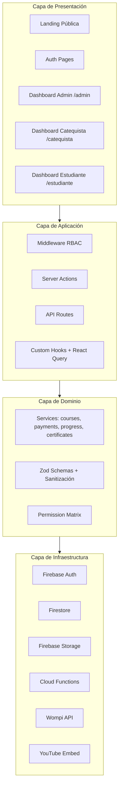

### 2.2 Módulos funcionales

| Módulo | Responsabilidad | Ubicación principal |
|--------|-----------------|---------------------|
| **Auth** | Registro, login, recuperación, custom claims | `lib/auth`, middleware |
| **Courses** | CRUD cursos, módulos, lecciones | `lib/services/courses` |
| **Learning** | Progreso, quizzes, examen final | `lib/services/progress` |
| **Payments** | Checkout Wompi, webhooks, enrollments | `lib/services/payments`, Functions |
| **Assignments** | Tareas PDF upload/review | `lib/services/assignments` |
| **Attendance** | Registro asistencia | `lib/services/attendance` |
| **Live Classes** | Zoom/Meet scheduling | `lib/services/live-classes` |
| **Forum** | Q&A con moderación | `lib/services/forum` |
| **Sacramental** | Requisitos y estados | `lib/services/sacramental` |
| **Certificates** | Emisión PDF | Cloud Function |
| **Prayers** | Mis Oraciones + progreso | `lib/services/prayers` |
| **Notifications** | In-app + email | `lib/services/notifications` |
| **Settings** | Branding, Wompi, institución | `settings` doc único |
| **Analytics** | Métricas dashboard admin | Agregaciones Firestore + cache |

### 2.3 Modelo de roles (RBAC)

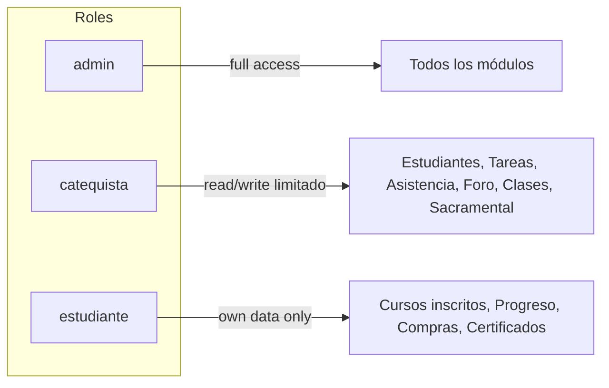

**Implementación de roles:**

1. Campo `role` en documento `users/{uid}` (fuente de verdad para UI).
2. **Custom Claims** en Firebase Auth (`role: admin | catequista | estudiante`) sincronizados vía Cloud Function `onUserWrite` — usados en Security Rules.
3. Middleware Next.js valida sesión + rol antes de renderizar rutas protegidas.

### 2.4 Flujo de datos general

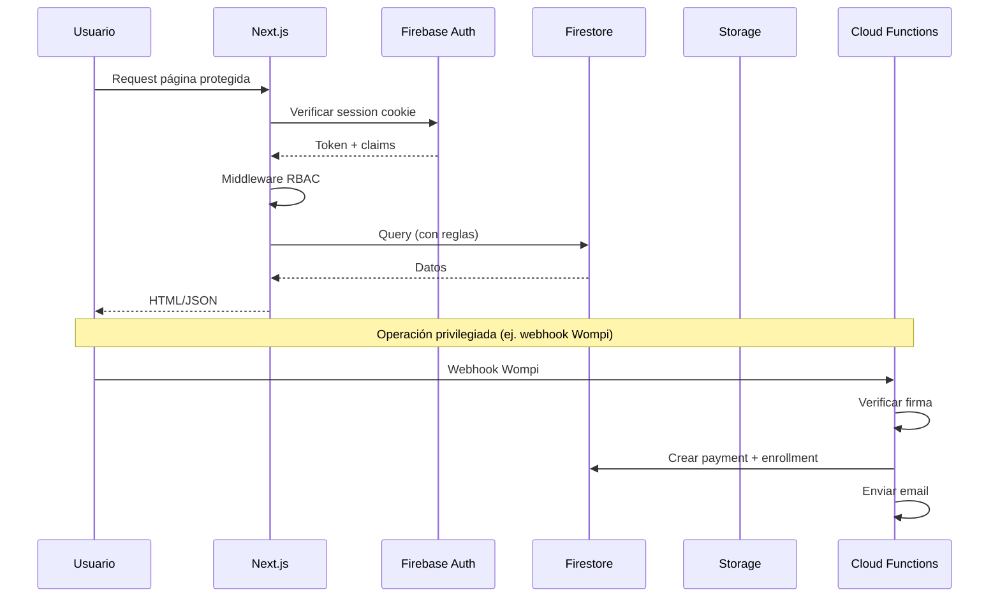

### 2.5 Decisiones arquitectónicas clave (ADRs)

| # | Decisión | Justificación |
|---|----------|---------------|
| ADR-01 | Firestore flat collections con IDs referenciados | Simplicidad queries; sin subcollections anidadas profundas |
| ADR-02 | `settings` como documento único `settings/global` | Single-tenant; una sola configuración institucional |
| ADR-03 | Enrollments separados de Payments | Desacopla acceso al curso de estado de pago; permite inscripción manual por admin |
| ADR-04 | Videos YouTube unlisted, no Storage | Reduce costos; embed con `youtube-nocookie` |
| ADR-05 | PDFs estudiante en Storage con signed URLs | Control de acceso temporal; reglas por enrollment |
| ADR-06 | Wompi webhook en Cloud Function | Endpoint estable; validación HMAC server-side |
| ADR-07 | Progreso calculado + cache en `enrollments` | Evita recalcular en cada request; actualizar en eventos |
| ADR-08 | Cloudflare Pages + Firebase (no Vercel) | Requisito del cliente; usar `@cloudflare/next-on-pages` |

---

## 3. Diagrama de base de datos

### 3.1 Diagrama entidad-relación (Firestore)

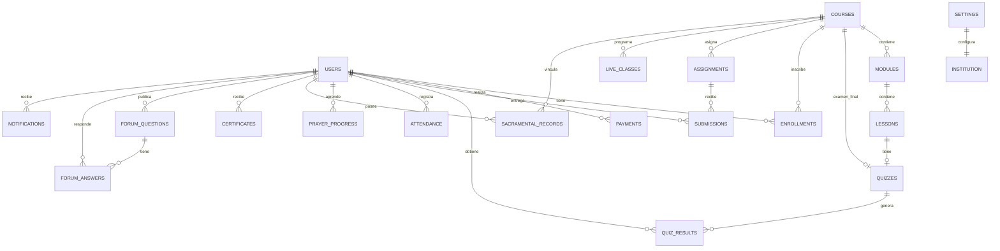

### 3.2 Colecciones y esquemas de documentos

#### `users/{uid}`

```typescript
{
  uid: string;                    // = document ID
  email: string;
  displayName: string;
  photoURL?: string;
  role: 'admin' | 'catequista' | 'estudiante';
  phone?: string;
  dateOfBirth?: Timestamp;
  parentName?: string;            // para menores
  status: 'active' | 'blocked';
  assignedCatequistaId?: string;  // para estudiantes
  createdAt: Timestamp;
  updatedAt: Timestamp;
  lastLoginAt?: Timestamp;
  studyTimeMinutes: number;       // acumulado
  achievements: string[];         // IDs de logros desbloqueados
}
```

#### `courses/{courseId}`

```typescript
{
  slug: 'bautismo' | 'primera-comunion' | 'confirmacion';
  title: string;
  description: string;
  shortDescription: string;
  imageUrl: string;               // Storage o URL externa
  instructor: string;
  instructorBio?: string;
  price: number;                  // en centavos USD (Wompi)
  currency: 'USD';
  category: 'sacramental';
  status: 'draft' | 'published' | 'archived';
  finalExamQuizId?: string;
  passingScore: number;           // % mínimo examen final (default 70)
  moduleOrder: string[];          // IDs ordenados
  stats: {
    enrollmentCount: number;
    completionCount: number;
  };
  createdAt: Timestamp;
  updatedAt: Timestamp;
  publishedAt?: Timestamp;
}
```

#### `modules/{moduleId}`

```typescript
{
  courseId: string;
  title: string;
  description?: string;
  order: number;
  lessonOrder: string[];
  status: 'active' | 'archived';
  createdAt: Timestamp;
  updatedAt: Timestamp;
}
```

#### `lessons/{lessonId}`

```typescript
{
  courseId: string;
  moduleId: string;
  title: string;
  description?: string;
  order: number;
  content: {
    video?: {
      youtubeId: string;
      duration?: number;          // segundos
    };
    pdfUrl?: string;              // Storage path
    pdfFileName?: string;
    resources: Array<{
      title: string;
      url: string;
      type: 'link' | 'pdf' | 'doc';
    }>;
  };
  quizId?: string;
  estimatedMinutes: number;
  status: 'draft' | 'published';
  createdAt: Timestamp;
  updatedAt: Timestamp;
}
```

#### `quizzes/{quizId}`

```typescript
{
  courseId: string;
  lessonId?: string;              // null = examen final
  type: 'lesson' | 'final_exam';
  title: string;
  description?: string;
  passingScore: number;           // %
  maxAttempts: number;            // 0 = ilimitado
  timeLimitMinutes?: number;
  questions: Array<{
    id: string;
    text: string;
    type: 'multiple_choice';
    options: Array<{
      id: string;
      text: string;
      isCorrect: boolean;         // solo visible admin/catequista en editor
    }>;
    explanation?: string;         // retroalimentación
  }>;
  shuffleQuestions: boolean;
  shuffleOptions: boolean;
  status: 'draft' | 'published';
  createdAt: Timestamp;
  updatedAt: Timestamp;
}
```

#### `quiz_results/{resultId}`

```typescript
{
  userId: string;
  quizId: string;
  courseId: string;
  lessonId?: string;
  attemptNumber: number;
  score: number;                  // %
  passed: boolean;
  answers: Array<{
    questionId: string;
    selectedOptionId: string;
    isCorrect: boolean;
  }>;
  startedAt: Timestamp;
  completedAt: Timestamp;
}
```

#### `enrollments/{enrollmentId}`

```typescript
{
  userId: string;
  courseId: string;
  paymentId?: string;
  status: 'active' | 'completed' | 'revoked';
  enrolledAt: Timestamp;
  completedAt?: Timestamp;
  progress: {
    percentComplete: number;
    modulesCompleted: string[];
    lessonsCompleted: string[];
    quizzesPassed: string[];
    finalExamPassed: boolean;
    averageScore: number;
    lastActivityAt: Timestamp;
    lastLessonId?: string;
  };
}
```

#### `payments/{paymentId}`

```typescript
{
  userId: string;
  courseId: string;
  amount: number;
  currency: 'USD';
  status: 'pending' | 'approved' | 'declined' | 'refunded';
  wompi: {
    transactionId: string;
    reference: string;            // nuestra referencia única
    paymentMethod?: string;
    rawResponse?: object;         // sanitizado, sin datos sensibles
  };
  createdAt: Timestamp;
  approvedAt?: Timestamp;
}
```

#### `assignments/{assignmentId}`

```typescript
{
  courseId: string;
  moduleId?: string;
  title: string;
  instructions: string;
  dueDate: Timestamp;
  maxScore: number;
  status: 'active' | 'archived';
  createdBy: string;
  createdAt: Timestamp;
  updatedAt: Timestamp;
}
```

#### `submissions/{submissionId}`

```typescript
{
  assignmentId: string;
  userId: string;
  courseId: string;
  fileUrl: string;                // Storage path
  fileName: string;
  status: 'pending' | 'graded' | 'returned';
  score?: number;
  feedback?: string;
  gradedBy?: string;
  submittedAt: Timestamp;
  gradedAt?: Timestamp;
}
```

#### `attendance/{attendanceId}`

```typescript
{
  userId: string;
  courseId: string;
  date: string;                     // YYYY-MM-DD
  status: 'present' | 'absent' | 'justified';
  notes?: string;
  recordedBy: string;
  createdAt: Timestamp;
  updatedAt: Timestamp;
}
```

#### `live_classes/{classId}`

```typescript
{
  courseId: string;
  title: string;
  description?: string;
  scheduledAt: Timestamp;
  durationMinutes: number;
  platform: 'zoom' | 'google_meet';
  meetingUrl: string;
  createdBy: string;
  status: 'scheduled' | 'completed' | 'cancelled';
  createdAt: Timestamp;
  updatedAt: Timestamp;
}
```

#### `prayers/{prayerId}`

```typescript
{
  slug: 'padre-nuestro' | 'ave-maria' | 'gloria' | 'credo' | 'salve';
  title: string;
  text: string;                   // texto completo formateado
  order: number;
  audioUrl?: string;
}
```

#### `prayer_progress/{userId_prayerId}`

```typescript
{
  userId: string;
  prayerId: string;
  learned: boolean;
  learnedAt?: Timestamp;
  practiceCount: number;
}
```

#### `sacramental_records/{recordId}`

```typescript
{
  userId: string;
  courseId: string;
  sacrament: 'bautismo' | 'primera_comunion' | 'confirmacion';
  status: 'not_started' | 'in_progress' | 'requirements_met' | 'scheduled' | 'completed';
  requirements: Array<{
    id: string;
    title: string;
    description?: string;
    completed: boolean;
    completedAt?: Timestamp;
    completedBy?: string;
  }>;
  observations: Array<{
    text: string;
    authorId: string;
    authorRole: string;
    createdAt: Timestamp;
  }>;
  updatedAt: Timestamp;
}
```

#### `certificates/{certificateId}`

```typescript
{
  userId: string;
  courseId: string;
  enrollmentId: string;
  certificateNumber: string;      // único, secuencial
  studentName: string;
  courseTitle: string;
  issuedAt: Timestamp;
  issuedBy: string;
  status: 'active' | 'revoked';
  revokedAt?: Timestamp;
  revokedReason?: string;
  pdfUrl: string;                 // Storage
}
```

#### `forum_questions/{questionId}`

```typescript
{
  courseId: string;
  userId: string;
  title: string;
  body: string;
  status: 'open' | 'answered' | 'closed' | 'hidden';
  answerCount: number;
  createdAt: Timestamp;
  updatedAt: Timestamp;
}
```

#### `forum_answers/{answerId}`

```typescript
{
  questionId: string;
  userId: string;
  body: string;
  isOfficial: boolean;            // respuesta de catequista/admin
  status: 'visible' | 'hidden';
  createdAt: Timestamp;
  updatedAt: Timestamp;
}
```

#### `notifications/{notificationId}`

```typescript
{
  userId: string;
  type: 'payment' | 'course' | 'assignment' | 'certificate' | 'forum' | 'class' | 'system';
  title: string;
  body: string;
  link?: string;
  read: boolean;
  createdAt: Timestamp;
}
```

#### `settings/global`

```typescript
{
  institution: {
    name: string;
    logoUrl: string;
    faviconUrl?: string;
    email: string;
    phone?: string;
    whatsapp?: string;
    address?: string;
    social: {
      facebook?: string;
      instagram?: string;
      youtube?: string;
    };
  };
  branding: {
    primaryColor: string;         // hex
    secondaryColor: string;
    accentColor: string;
  };
  wompi: {
    publicKey: string;
    // privateKey NUNCA en Firestore — solo en Firebase Functions secrets
    environment: 'sandbox' | 'production';
    webhookSecret?: string;
    connectionStatus: 'connected' | 'disconnected' | 'error';
    lastVerifiedAt?: Timestamp;
  };
  certificates: {
    signatureUrl?: string;
    signatureName?: string;
    signatureTitle?: string;
    templateFooter?: string;
  };
  email: {
    fromName: string;
    fromEmail: string;
    // SMTP/API keys en Functions secrets
  };
  updatedAt: Timestamp;
  updatedBy: string;
}
```

### 3.3 Índices compuestos requeridos

| Colección | Campos | Uso |
|-----------|--------|-----|
| `enrollments` | `userId`, `courseId` | Verificar inscripción |
| `enrollments` | `courseId`, `status` | Lista estudiantes por curso |
| `payments` | `status`, `createdAt` DESC | Dashboard pagos |
| `payments` | `userId`, `createdAt` DESC | Historial compras estudiante |
| `quiz_results` | `userId`, `quizId`, `attemptNumber` | Historial intentos |
| `attendance` | `courseId`, `date` | Registro asistencia |
| `submissions` | `assignmentId`, `status` | Tareas pendientes |
| `forum_questions` | `courseId`, `createdAt` DESC | Foro por curso |
| `live_classes` | `courseId`, `scheduledAt` ASC | Próximas clases |
| `notifications` | `userId`, `read`, `createdAt` DESC | Bandeja notificaciones |

---

## 4. Relaciones Firestore

### 4.1 Mapa de referencias

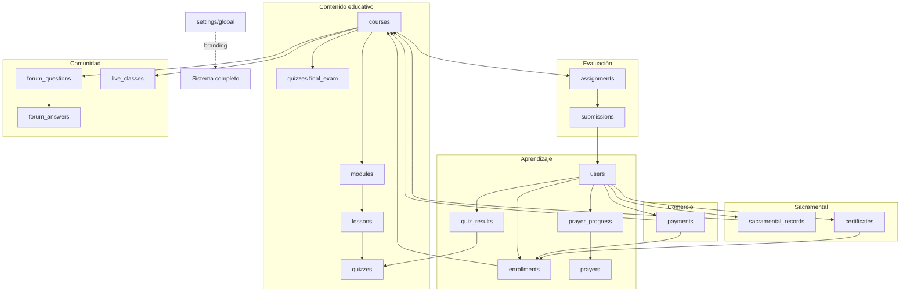

### 4.2 Reglas de integridad (aplicadas en código)

| Relación | Regla |
|----------|-------|
| `modules.courseId` | Debe existir curso activo |
| `lessons.moduleId` | Módulo debe pertenecer al mismo `courseId` |
| `enrollments` | Máximo 1 activo por `userId + courseId` |
| `payments → enrollment` | Solo crear enrollment si `payment.status === 'approved'` o admin manual |
| `quiz_results` | `attemptNumber` ≤ `quiz.maxAttempts` (si > 0) |
| `certificates` | Solo si `enrollment.progress.finalExamPassed === true` |
| `submissions` | Solo si usuario tiene enrollment activo en `courseId` |
| `sacramental_records` | Auto-crear al primer enrollment en curso sacramental |

### 4.3 Estrategia de IDs

- **Cursos:** slugs fijos (`bautismo`, `primera-comunion`, `confirmacion`) — facilita URLs semánticas.
- **Resto:** Auto-ID Firestore (`collection.doc()`).
- **Referencias compuestas:** `prayer_progress` usa `{userId}_{prayerId}` como ID para upserts idempotentes.

---

## 5. Estructura de carpetas

```
catequesis-online/
├── .github/
│   └── workflows/
│       ├── ci.yml                    # Lint, typecheck, build
│       └── deploy-cloudflare.yml     # Deploy a Cloudflare Pages
├── docs/
│   └── ARQUITECTURA-CATEQUESIS-ONLINE.md
├── firebase/
│   ├── firestore.rules
│   ├── firestore.indexes.json
│   ├── storage.rules
│   └── functions/
│       ├── package.json
│       ├── tsconfig.json
│       └── src/
│           ├── index.ts
│           ├── auth/
│           │   └── onUserCreate.ts       # Set claims, create user doc
│           ├── payments/
│           │   ├── wompiWebhook.ts
│           │   └── createPaymentLink.ts
│           ├── certificates/
│           │   └── generateCertificate.ts
│           ├── notifications/
│           │   └── sendEmail.ts
│           └── triggers/
│               ├── onEnrollmentUpdate.ts # Recalcular progreso
│               └── onQuizResult.ts
├── public/
│   ├── fonts/
│   └── images/
├── src/
│   ├── app/
│   │   ├── (public)/
│   │   │   ├── page.tsx                  # Landing
│   │   │   ├── cursos/
│   │   │   │   ├── page.tsx              # Catálogo
│   │   │   │   └── [slug]/page.tsx       # Detalle curso
│   │   │   ├── nosotros/page.tsx
│   │   │   └── contacto/page.tsx
│   │   ├── (auth)/
│   │   │   ├── login/page.tsx
│   │   │   ├── registro/page.tsx
│   │   │   └── recuperar/page.tsx
│   │   ├── (dashboard)/
│   │   │   ├── layout.tsx                # Shell con sidebar
│   │   │   ├── admin/
│   │   │   │   ├── page.tsx              # Dashboard métricas
│   │   │   │   ├── cursos/
│   │   │   │   ├── modulos/
│   │   │   │   ├── lecciones/
│   │   │   │   ├── quizzes/
│   │   │   │   ├── estudiantes/
│   │   │   │   ├── pagos/
│   │   │   │   ├── certificados/
│   │   │   │   ├── tareas/
│   │   │   │   ├── clases/
│   │   │   │   ├── oraciones/
│   │   │   │   ├── sacramental/
│   │   │   │   ├── foro/
│   │   │   │   ├── notificaciones/
│   │   │   │   └── configuracion/
│   │   │   ├── catequista/
│   │   │   │   ├── page.tsx
│   │   │   │   ├── estudiantes/
│   │   │   │   ├── tareas/
│   │   │   │   ├── asistencia/
│   │   │   │   ├── foro/
│   │   │   │   ├── clases/
│   │   │   │   └── sacramental/
│   │   │   └── estudiante/
│   │   │       ├── page.tsx
│   │   │       ├── cursos/
│   │   │       ├── lecciones/[lessonId]/
│   │   │       ├── evaluaciones/
│   │   │       ├── tareas/
│   │   │       ├── oraciones/
│   │   │       ├── progreso/
│   │   │       ├── certificados/
│   │   │       ├── compras/
│   │   │       ├── clases/
│   │   │       └── foro/
│   │   ├── api/
│   │   │   ├── auth/
│   │   │   │   └── session/route.ts
│   │   │   ├── payments/
│   │   │   │   ├── create/route.ts
│   │   │   │   └── verify/route.ts
│   │   │   ├── upload/
│   │   │   │   └── route.ts
│   │   │   └── certificates/
│   │   │       └── [id]/route.ts
│   │   ├── layout.tsx
│   │   ├── globals.css
│   │   └── providers.tsx
│   ├── components/
│   │   ├── ui/                           # Shadcn
│   │   ├── layout/
│   │   │   ├── sidebar.tsx
│   │   │   ├── header.tsx
│   │   │   ├── mobile-nav.tsx
│   │   │   └── theme-toggle.tsx
│   │   ├── dashboard/
│   │   │   ├── stat-card.tsx
│   │   │   ├── charts/
│   │   │   └── data-table.tsx
│   │   ├── courses/
│   │   ├── lessons/
│   │   │   ├── video-player.tsx
│   │   │   └── lesson-content.tsx
│   │   ├── quizzes/
│   │   ├── payments/
│   │   │   └── wompi-checkout.tsx
│   │   ├── forum/
│   │   ├── certificates/
│   │   └── shared/
│   │       ├── empty-state.tsx
│   │       ├── loading.tsx
│   │       └── error-boundary.tsx
│   ├── lib/
│   │   ├── firebase/
│   │   │   ├── client.ts
│   │   │   ├── admin.ts
│   │   │   └── converters.ts
│   │   ├── auth/
│   │   │   ├── session.ts
│   │   │   └── permissions.ts
│   │   ├── services/
│   │   │   ├── courses.ts
│   │   │   ├── enrollments.ts
│   │   │   ├── progress.ts
│   │   │   ├── payments.ts
│   │   │   ├── quizzes.ts
│   │   │   ├── assignments.ts
│   │   │   ├── attendance.ts
│   │   │   ├── forum.ts
│   │   │   ├── certificates.ts
│   │   │   ├── prayers.ts
│   │   │   ├── sacramental.ts
│   │   │   ├── notifications.ts
│   │   │   └── settings.ts
│   │   ├── validations/
│   │   │   └── schemas.ts                # Zod
│   │   ├── utils/
│   │   │   ├── sanitize.ts
│   │   │   ├── dates.ts
│   │   │   └── format.ts
│   │   └── constants/
│   │       ├── roles.ts
│   │       └── routes.ts
│   ├── hooks/
│   │   ├── use-auth.ts
│   │   ├── use-enrollment.ts
│   │   ├── use-progress.ts
│   │   └── use-theme-settings.ts
│   ├── types/
│   │   ├── user.ts
│   │   ├── course.ts
│   │   ├── payment.ts
│   │   └── index.ts
│   └── middleware.ts
├── .env.example
├── .env.local                          # NO commitear
├── components.json                     # Shadcn config
├── next.config.ts
├── tailwind.config.ts
├── tsconfig.json
├── package.json
├── wrangler.toml                       # Cloudflare Pages
└── README.md
```

---

## 6. Wireframes de dashboards

> Wireframes interactivos disponibles en el Canvas adjunto.  
> Estilo visual: inspiración Coursera/Kajabi — sidebar fijo, cards con métricas, tipografía clara, modo oscuro/claro.

### 6.1 Layout compartido (todos los dashboards)

```
┌──────────────────────────────────────────────────────────────────┐
│ [≡]  CATEQUESIS ONLINE          [🔔] [🌙/☀️] [Avatar ▼]         │  ← Header 64px
├────────────┬─────────────────────────────────────────────────────┤
│            │  Breadcrumb: Dashboard > Sección                   │
│  SIDEBAR   │  ┌─────────────────────────────────────────────┐  │
│  240px     │  │  Título de sección          [Acción primaria]│  │
│            │  └─────────────────────────────────────────────┘  │
│  Logo      │                                                      │
│  ────────  │  ┌──────────┐ ┌──────────┐ ┌──────────┐ ┌──────┐ │
│  Nav items │  │ Stat 1   │ │ Stat 2   │ │ Stat 3   │ │Stat 4│ │
│  con icono │  └──────────┘ └──────────┘ └──────────┘ └──────┘ │
│            │                                                      │
│  ────────  │  ┌─────────────────────┐ ┌─────────────────────┐   │
│  Usuario   │  │  Contenido principal │ │  Panel lateral      │   │
│  Cerrar    │  │  (tabla / cards /    │ │  (opcional)         │   │
│  sesión    │  │   formulario)        │ │                     │   │
│            │  └─────────────────────┘ └─────────────────────┘   │
└────────────┴─────────────────────────────────────────────────────┘

Mobile: Sidebar → Drawer overlay · Stats en carrusel horizontal
```

### 6.2 Dashboard Administrador (`/admin`)

```
┌─ SIDEBAR ─────────────┐
│ 📊 Dashboard          │  ← activo
│ 📚 Cursos             │
│ 📖 Módulos            │
│ 🎥 Lecciones          │
│ 📝 Quizzes            │
│ 👨‍🎓 Estudiantes        │
│ 💳 Pagos              │
│ 📄 Certificados       │
│ 📋 Tareas             │
│ 📅 Clases             │
│ 🙏 Oraciones          │
│ ⛪ Gestión Sacramental│
│ 💬 Foro               │
│ 🔔 Notificaciones     │
│ ⚙️ Configuración      │
└───────────────────────┘

CONTENIDO DASHBOARD:
┌────────────┐ ┌────────────┐ ┌────────────┐ ┌────────────┐
│ 156        │ │ 3          │ │ $2,340     │ │ $18,500    │
│ Estudiantes│ │ Cursos     │ │ Ingresos   │ │ Ventas     │
│            │ │ activos    │ │ del mes    │ │ totales    │
└────────────┘ └────────────┘ └────────────┘ └────────────┘

┌────────────┐ ┌────────────┐ ┌────────────┐
│ 89         │ │ 12         │ │ 3          │
│ Certificados│ │ Tareas     │ │ Próximas   │
│ emitidos   │ │ pendientes │ │ clases     │
└────────────┘ └────────────┘ └────────────┘

┌─────────────────────────────┐ ┌─────────────────────────────┐
│ GRÁFICA: Ventas por mes     │ │ GRÁFICA: Nuevos estudiantes │
│ (barras, últimos 12 meses)  │ │ (línea, últimos 6 meses)    │
└─────────────────────────────┘ └─────────────────────────────┘

┌─────────────────────────────┐ ┌─────────────────────────────┐
│ GRÁFICA: Cursos más vendidos│ │ GRÁFICA: Certificados/mes   │
│ (donut: 3 sacramentos)      │ │ (barras)                    │
└─────────────────────────────┘ └─────────────────────────────┘

┌─────────────────────────────────────────────────────────────┐
│ ACTIVIDAD RECIENTE (tabla)                                   │
│ • Juan compró Confirmación — hace 2h                         │
│ • María completó quiz Módulo 3 — hace 4h                     │
│ • Certificado emitido: Pedro López — ayer                    │
└─────────────────────────────────────────────────────────────┘
```

**Pantallas clave adicionales:**

- **Cursos:** Grid de cards con imagen, estado (draft/published), precio, acciones (editar, duplicar, publicar).
- **Estudiantes:** Tabla con búsqueda, filtros por curso/estado, acciones (bloquear, reiniciar progreso).
- **Pagos:** Tabla con filtros fecha/estado/curso, export CSV, detalle transacción Wompi.
- **Configuración:** Tabs (General, Branding, Wompi, Certificados, Email).

### 6.3 Dashboard Catequista (`/catequista`)

```
┌─ SIDEBAR ─────────────┐
│ 📊 Dashboard          │
│ 👨‍🎓 Estudiantes        │
│ 📋 Tareas             │
│ ✅ Asistencia         │
│ 💬 Foro               │
│ 📅 Clases             │
│ ⛪ Gestión Sacramental│
└───────────────────────┘

CONTENIDO DASHBOARD:
┌────────────┐ ┌────────────┐ ┌────────────┐ ┌────────────┐
│ 24         │ │ 8          │ │ 2          │ │ 5          │
│ Estudiantes│ │ Tareas     │ │ Próximas   │ │ Consultas  │
│ asignados  │ │ pendientes │ │ clases     │ │ pendientes │
└────────────┘ └────────────┘ └────────────┘ └────────────┘

┌─────────────────────────────────────────────────────────────┐
│ ESTUDIANTES CON PROGRESO BAJO (< 50%)                       │
│ [Avatar] Ana G. — Primera Comunión — 32% — [Ver detalle]   │
│ [Avatar] Luis M. — Confirmación — 45% — [Ver detalle]      │
└─────────────────────────────────────────────────────────────┘

┌─────────────────────────────┐ ┌─────────────────────────────┐
│ TAREAS POR REVISAR          │ │ PRÓXIMA CLASE EN VIVO       │
│ Lista con badge "nuevo"     │ │ Zoom — Sábado 10:00 AM      │
│ [Revisar PDF]               │ │ [Unirse] [Editar]           │
└─────────────────────────────┘ └─────────────────────────────┘
```

### 6.4 Dashboard Estudiante (`/estudiante`)

```
┌─ SIDEBAR ─────────────┐
│ 🏠 Inicio             │
│ 📚 Mis Cursos         │
│ 📖 Lecciones          │
│ 📝 Evaluaciones       │
│ 📋 Mis Tareas         │
│ 🙏 Mis Oraciones      │
│ 📈 Mi Progreso        │
│ 🏆 Certificados       │
│ 🛒 Mis Compras        │
│ 📅 Clases en Vivo     │
│ 💬 Foro               │
└───────────────────────┘

CONTENIDO INICIO (estilo Duolingo/Coursera):
┌─────────────────────────────────────────────────────────────┐
│ ¡Hola, María! 👋                                            │
│ ┌─────────────────────────────────────────────────────────┐ │
│ │ CONTINUAR APRENDIENDO                                   │ │
│ │ Primera Comunión — Módulo 2: Los Sacramentos          │ │
│ │ ████████████░░░░░░░░ 65%                                │ │
│ │ [Continuar lección →]                                   │ │
│ └─────────────────────────────────────────────────────────┘ │
└─────────────────────────────────────────────────────────────┘

┌──────────────────┐ ┌──────────────────┐ ┌──────────────────┐
│ PRÓXIMA CLASE    │ │ ÚLTIMA ACTIVIDAD │ │ RACHA / LOGROS   │
│ Sáb 10:00 AM     │ │ Quiz aprobado    │ │ 🔥 5 días        │
│ Google Meet      │ │ hace 2 días      │ │ 3/10 logros      │
└──────────────────┘ └──────────────────┘ └──────────────────┘

┌─────────────────────────────────────────────────────────────┐
│ MIS CURSOS (cards horizontales)                             │
│ [Card Bautismo] [Card Primera Comunión ✓] [Card Confirmación]│
└─────────────────────────────────────────────────────────────┘

┌─────────────────────────────┐ ┌─────────────────────────────┐
│ ESTADÍSTICAS                │ │ MIS ORACIONES               │
│ Tiempo: 12h 30m             │ │ ████░ 4/5 aprendidas        │
│ Promedio: 85%               │ │ [Practicar →]               │
└─────────────────────────────┘ └─────────────────────────────┘
```

### 6.5 Páginas públicas

**Landing (`/`):**
- Hero con CTA "Comenzar preparación"
- 3 cards de cursos sacramentales
- Testimonios / beneficios
- Footer con redes y contacto

**Detalle curso (`/cursos/[slug]`):**
- Hero imagen + precio + botón "Comprar" / "Continuar" (si inscrito)
- Tabs: Contenido del curso (módulos colapsables), Instructor, FAQ

**Checkout:**
- Resumen curso + precio
- Redirect a Wompi widget / página de pago

---

## 7. Flujo de pagos (Wompi)

### 7.1 Diagrama de secuencia

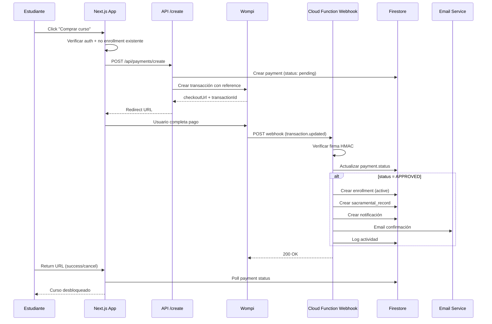

### 7.2 Estados del pago

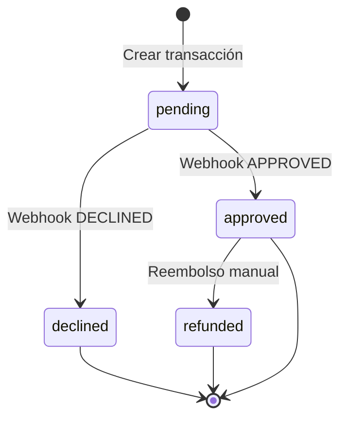

### 7.3 Configuración Wompi (Dashboard Admin)

```
┌─────────────────────────────────────────────────────────────┐
│ CONFIGURACIÓN WOMPI                                          │
├─────────────────────────────────────────────────────────────┤
│ Entorno:     ( ) Sandbox  (•) Producción                    │
│ Public Key:  [pk_live_xxxxxxxxxxxxxxxx        ]            │
│ Private Key: [•••••••••••••••••••••••••••••••••] 👁         │
│                                                              │
│ Estado: ● Conectado (verificado hace 2 horas)               │
│                                                              │
│ [Probar conexión]  [Guardar]                                │
│                                                              │
│ ⚠️ La Private Key se almacena en Firebase Secrets,           │
│    nunca en Firestore ni en el cliente.                     │
└─────────────────────────────────────────────────────────────┘
```

### 7.4 Seguridad del webhook

1. Validar header `X-Event-Checksum` con algoritmo Wompi (SHA256).
2. Idempotencia: verificar si `wompi.transactionId` ya fue procesado.
3. Monto: comparar `amount` del webhook vs `payment.amount` en Firestore.
4. Solo Cloud Function tiene acceso a private key.

### 7.5 Referencia única de pago

Formato: `CO-{courseSlug}-{userId_short}-{timestamp}`  
Ejemplo: `CO-confirmacion-a1b2c3-1717680000`

---

## 8. Flujo de estudiantes

### 8.1 Diagrama de flujo completo

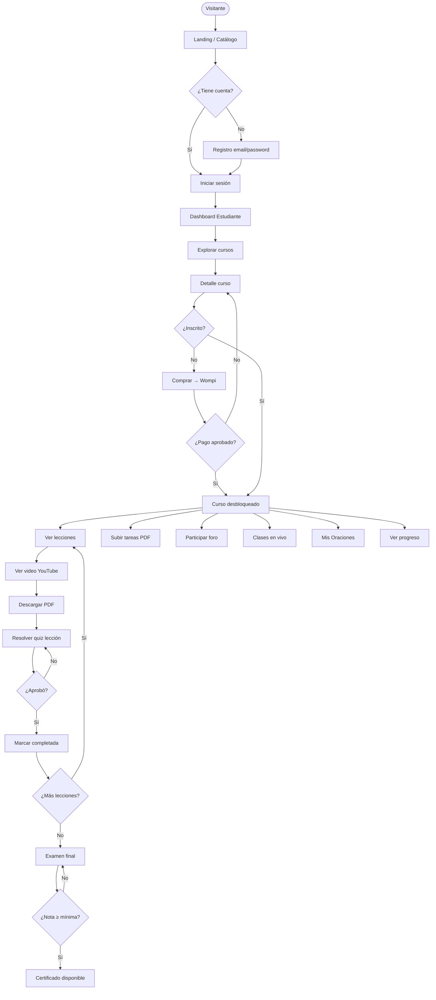

### 8.2 Cálculo de progreso

```
progreso% = (
  (lecciones_completadas / total_lecciones) * 0.6 +
  (quizzes_aprobados / total_quizzes) * 0.25 +
  (examen_final_aprobado ? 0.15 : 0)
) * 100
```

Actualizado vía Cloud Function trigger al marcar lección/quiz completado.

### 8.3 Logros (gamificación Duolingo-style)

| Logro | Condición |
|-------|-----------|
| Primer paso | Completar primera lección |
| Quiz master | Aprobar 5 quizzes al primer intento |
| Devoto | Aprender las 5 oraciones |
| Constante | 7 días consecutivos de actividad |
| Graduado | Obtener certificado |

---

## 9. Flujo de catequistas

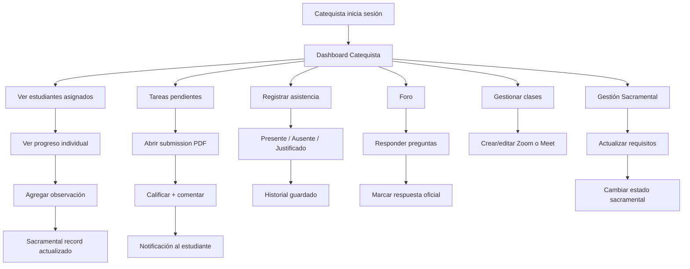

### 9.1 Asignación estudiante-catequista

- Admin asigna `assignedCatequistaId` al crear/editar estudiante.
- Catequista solo ve estudiantes donde `assignedCatequistaId === su uid`.
- Admin ve todos.

---

## 10. Flujo de administradores

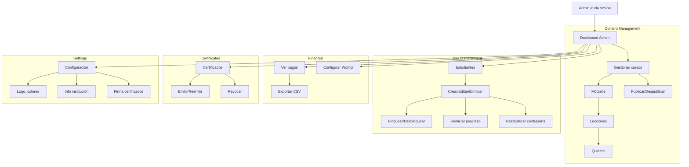

### 10.1 Bootstrap inicial (primer admin)

1. Script de setup (`firebase functions:shell`) crea primer usuario admin.
2. O: Firebase Console crea usuario → Function asigna claim `admin` manualmente.
3. Admin crea los 3 cursos base desde dashboard (plantillas vacías publicables).

---

## 11. Estrategia de despliegue

### 11.1 Entornos

| Entorno | Frontend | Firebase | Wompi |
|---------|----------|----------|-------|
| **Development** | `localhost:3000` | Proyecto dev o emuladores | Sandbox |
| **Staging** | `staging.catequesis.online` | Mismo proyecto, prefijo colecciones opcional | Sandbox |
| **Production** | `catequesis.online` | `catequesis-online-4e0f3` | Producción |

### 11.2 Pipeline CI/CD

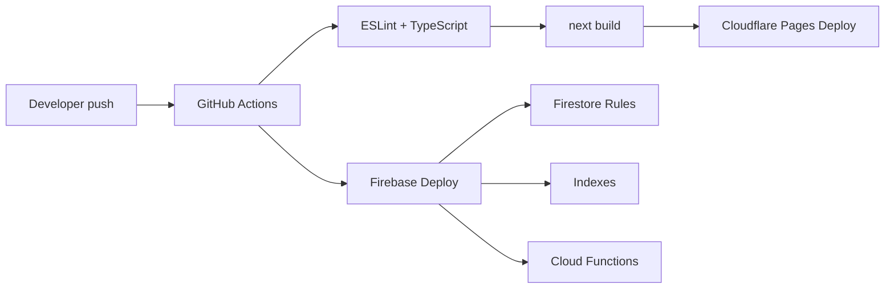

### 11.3 Cloudflare Pages

```yaml
# wrangler.toml (conceptual)
name = "catequesis-online"
compatibility_date = "2024-01-01"
pages_build_output_dir = ".vercel/output/static"

[vars]
# Variables públicas en dashboard Cloudflare
```

**Build command:**
```bash
npx @cloudflare/next-on-pages@1
```

**Variables de entorno (Cloudflare Dashboard):**
- `NEXT_PUBLIC_FIREBASE_*` (públicas)
- `FIREBASE_CLIENT_EMAIL` (secreto)
- `FIREBASE_PRIVATE_KEY` (secreto)

### 11.4 Firebase Deploy

```bash
firebase deploy --only firestore:rules,firestore:indexes,storage,functions
```

### 11.5 Dominio y DNS

```
catequesis.online     → CNAME → xxx.pages.dev (Cloudflare Pages)
www                   → redirect → apex
```

Webhook Wompi URL: `https://us-central1-catequesis-online-4e0f3.cloudfunctions.net/wompiWebhook`

### 11.6 Checklist pre-producción

- [ ] Firestore Rules auditadas
- [ ] Storage Rules auditadas
- [ ] Índices compuestos desplegados
- [ ] Secrets en Firebase Functions Config
- [ ] Wompi webhook registrado en dashboard Wompi
- [ ] Email transaccional configurado (Resend/SendGrid)
- [ ] Primer admin creado
- [ ] 3 cursos creados (estructura vacía publicable)
- [ ] 5 oraciones seed en `prayers`
- [ ] `settings/global` inicializado
- [ ] SSL activo en Cloudflare
- [ ] Rate limiting en API routes

---

## 12. Seguridad

### 12.1 Firebase Security Rules (resumen)

```javascript
// firestore.rules (conceptual)
rules_version = '2';
service cloud.firestore {
  match /databases/{database}/documents {

    function isAuth() { return request.auth != null; }
    function isAdmin() { return request.auth.token.role == 'admin'; }
    function isCatequista() { return request.auth.token.role == 'catequista'; }
    function isOwner(uid) { return request.auth.uid == uid; }
    function isEnrolled(courseId) {
      return exists(/databases/$(database)/documents/enrollments/$(request.auth.uid + '_' + courseId));
    }

    match /users/{userId} {
      allow read: if isAuth() && (isOwner(userId) || isAdmin() || isCatequista());
      allow write: if isAdmin() || (isOwner(userId) && !request.resource.data.diff(resource.data).affectedKeys().hasAny(['role', 'status']));
    }

    match /courses/{courseId} {
      allow read: if resource.data.status == 'published' || isAdmin() || isCatequista();
      allow write: if isAdmin();
    }

    match /payments/{paymentId} {
      allow read: if isAdmin() || (isAuth() && resource.data.userId == request.auth.uid);
      allow create: if false; // solo server
      allow update: if false; // solo webhook
    }

    match /settings/{doc} {
      allow read: if true; // branding público
      allow write: if isAdmin();
    }

    // ... reglas similares para cada colección
  }
}
```

### 12.2 Protección de rutas (middleware)

```typescript
// Rutas protegidas por rol
const ROUTE_PERMISSIONS = {
  '/admin': ['admin'],
  '/catequista': ['admin', 'catequista'],
  '/estudiante': ['admin', 'catequista', 'estudiante'],
};
```

### 12.3 Sanitización

- **DOMPurify** para contenido foro y descripciones HTML.
- **Zod** en todos los formularios server/client.
- Validación MIME type en uploads PDF (application/pdf).
- Límite tamaño archivo: 10MB.

### 12.4 Storage paths

```
/courses/{courseId}/images/{file}
/lessons/{lessonId}/pdfs/{file}
/submissions/{userId}/{assignmentId}/{file}
/certificates/{userId}/{certificateId}.pdf
/settings/logo.{ext}
/settings/signature.{ext}
```

### 12.5 Credenciales — ADVERTENCIA CRÍTICA

> **Las credenciales Firebase compartidas en este chat (private key, service account) deben:**
> 1. Almacenarse SOLO en variables de entorno / Firebase Secrets.
> 2. NUNCA commitearse a GitHub.
> 3. Rotarse si han sido expuestas públicamente.
> 4. La `privateKey` de Wompi NUNCA debe estar en `settings/global` de Firestore.

---

## 13. Plan de implementación por fases

Una vez aprobada esta arquitectura, el desarrollo procederá en fases:

### Fase 1 — Fundación (Semana 1-2)
- Scaffold Next.js 15 + Tailwind + Shadcn + Firebase
- Auth completo (registro, login, recuperación, roles)
- Middleware RBAC
- Layout dashboards (sidebar, theme toggle)
- `settings/global` + página configuración básica
- Firestore Rules base
- Deploy pipeline Cloudflare + Firebase

### Fase 2 — Contenido educativo (Semana 3-4)
- CRUD Cursos, Módulos, Lecciones (admin)
- Reproductor YouTube + PDF viewer
- Quizzes con corrección automática
- Progreso y enrollments
- Dashboard estudiante: cursos, lecciones, evaluaciones

### Fase 3 — Pagos (Semana 5)
- Integración Wompi checkout
- Webhook Cloud Function
- Flujo compra completo
- Dashboard pagos admin
- Mis compras estudiante

### Fase 4 — Evaluación y comunidad (Semana 6)
- Tareas (upload/review/grade)
- Examen final
- Foro con moderación
- Clases en vivo
- Asistencia

### Fase 5 — Sacramental y certificados (Semana 7)
- Gestión sacramental
- Mis Oraciones
- Generación certificados PDF
- Logros y estadísticas

### Fase 6 — Pulido y producción (Semana 8)
- Notificaciones
- Emails transaccionales
- Gráficas dashboard admin
- Accesibilidad audit
- Testing E2E críticos
- Documentación operativa

---

## Aprobación

| Entregable | Estado |
|------------|--------|
| 1. Arquitectura completa | ✅ |
| 2. Diagrama de base de datos | ✅ |
| 3. Relaciones Firestore | ✅ |
| 4. Estructura de carpetas | ✅ |
| 5. Wireframes dashboards | ✅ |
| 6. Flujo de pagos | ✅ |
| 7. Flujo estudiantes | ✅ |
| 8. Flujo catequistas | ✅ |
| 9. Flujo administradores | ✅ |
| 10. Estrategia de despliegue | ✅ |

---

**Siguiente paso:** Revisión y aprobación de esta arquitectura. Una vez aprobada, iniciar **Fase 1** con código de producción.
